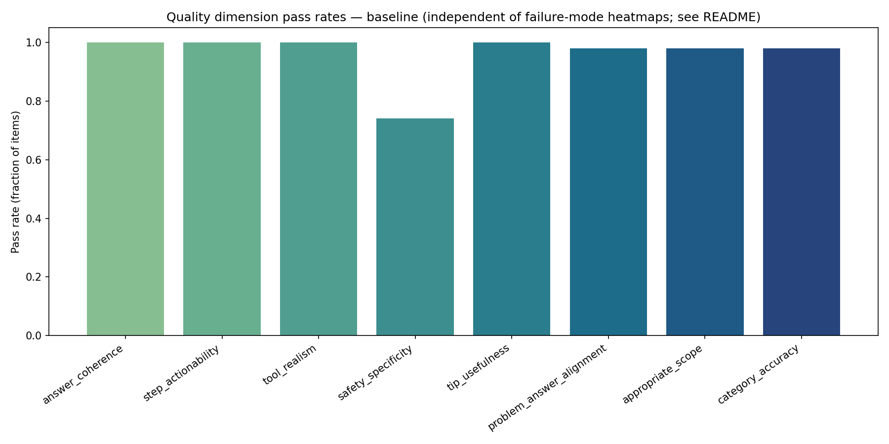
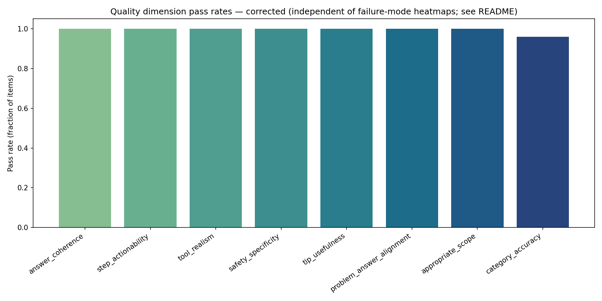
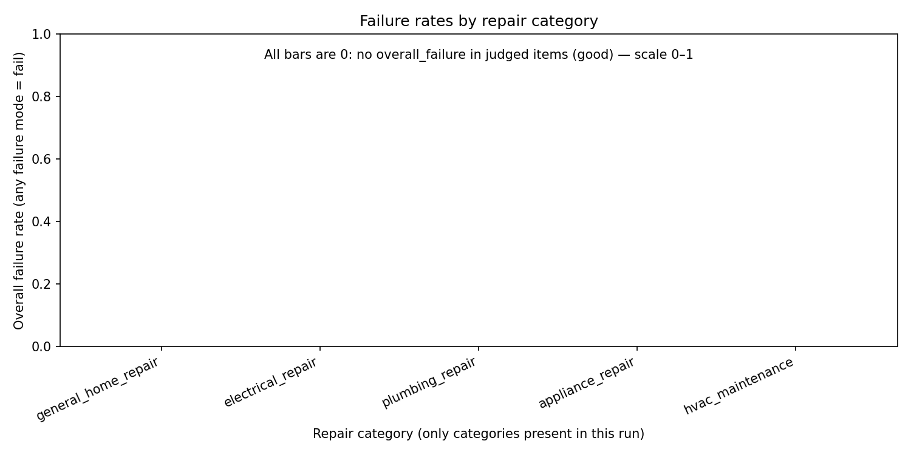
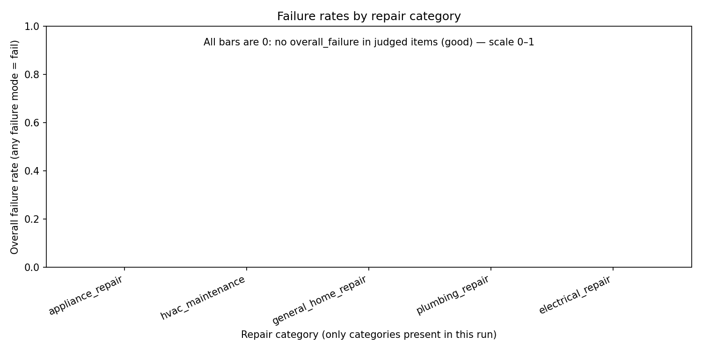
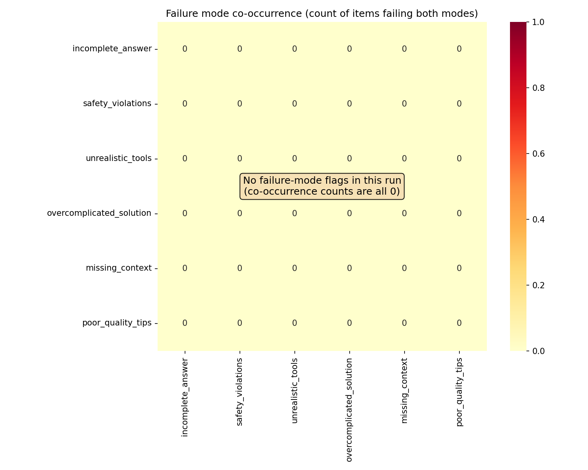
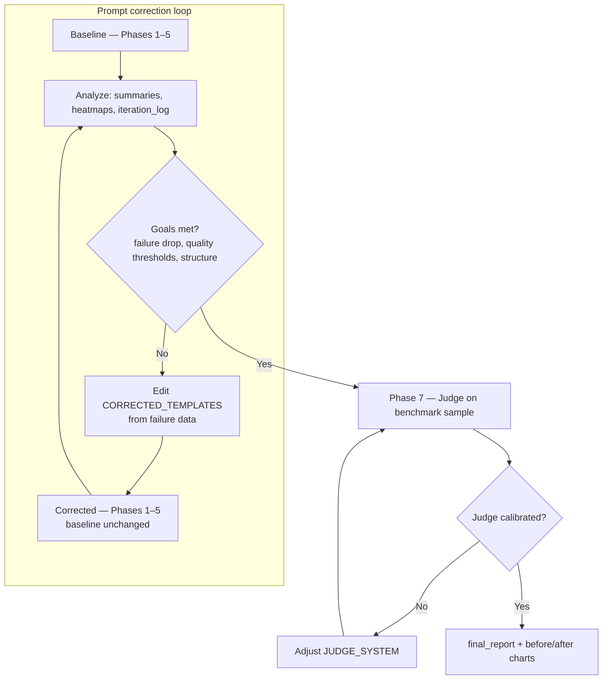
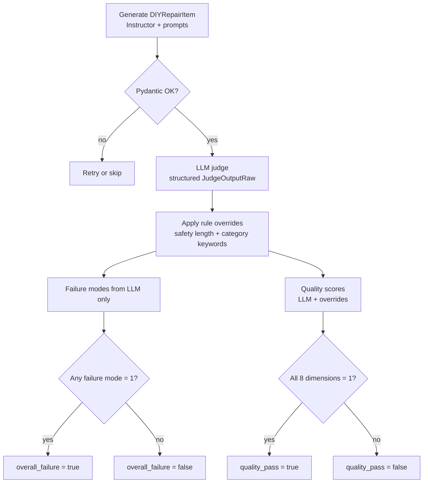
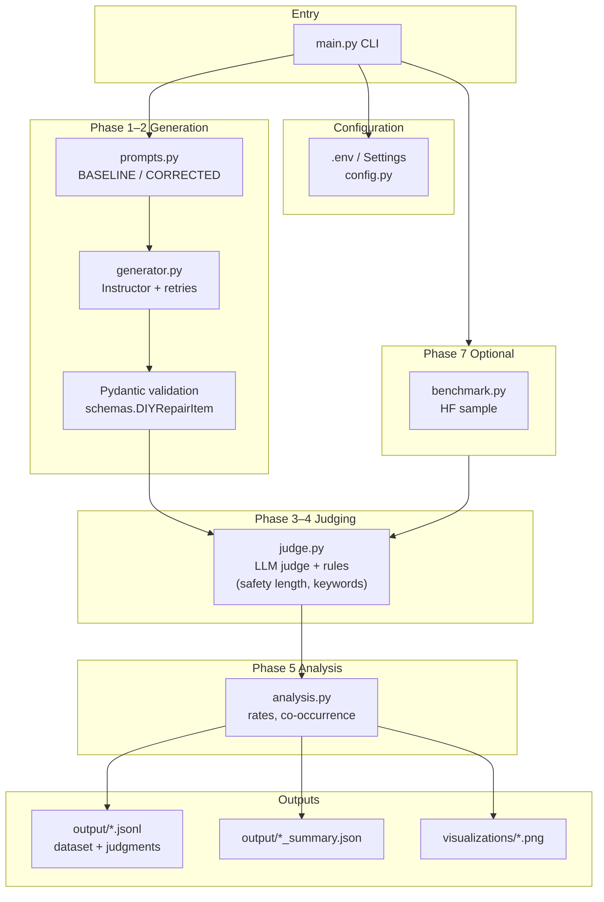

# Project: Home DIY Repair Q&A Synthetic Data Generator

This project implements a complete synthetic-data pipeline for Home DIY repair Q&A: generate → validate → LLM-as-judge → analysis → prompt correction → benchmark calibration.

## Results snapshot

This run uses OpenRouter's `meta-llama/llama-3.1-8b-instruct` output under `output/meta-llama_llama-3.1-8b-instruct/` as the main public evidence set. I used OpenRouter for the LLM-as-judge and benchmark calibration after hitting Groq rate limits, so this evidence set includes the completed Phase 7 benchmark step.

| Metric | Baseline | Corrected | Target |
|--------|---------:|----------:|--------|
| Generated items | 50 | 50 | ≥50 |
| Structural validation pass rate | 100% | 100% | ≥95% |
| Overall failure rate | 0% | 0% | lower is better |
| Quality pass rate across all 8 dimensions | 74% | 96% | ≥80% |
| Safety specificity pass rate | 74% | 100% | improve weak dimensions |
| Category accuracy pass rate | 98% | 96% | high coverage |

Key finding: the six binary failure modes stayed at 0% for both runs, but the stricter quality dimensions exposed the baseline weakness. The corrected prompts improved all-dimension quality pass rate from **74% → 96%**, mainly by fixing safety specificity.

Benchmark calibration passed on 50 Hugging Face reference rows with **98% quality pass rate** and **100% structural pass rate**, which supports using the judge for generated-item analysis.

## Model comparison: GPT vs Llama

I ran the same synthetic-data workflow twice: once with `gpt-5.4-mini` and once with OpenRouter's `meta-llama/llama-3.1-8b-instruct`. The side-by-side results show that model choice affects both generation quality and how much the correction loop has room to improve.

| Model / artifact folder | Run | Items | Structural pass | Overall failure | Quality pass | Safety specificity | Category accuracy |
|-------------------------|-----|------:|----------------:|----------------:|-------------:|-------------------:|------------------:|
| `gpt-5.4-mini` | Baseline | 50 | 100% | 0% | 100% | 100% | 100% |
| `gpt-5.4-mini` | Corrected | 50 | 100% | 0% | 100% | 100% | 100% |
| `gpt-5.4-mini` | Benchmark | 50 | 100% | 0% | 98% | 100% | 98% |
| `meta-llama/llama-3.1-8b-instruct` | Baseline | 50 | 100% | 0% | 74% | 74% | 98% |
| `meta-llama/llama-3.1-8b-instruct` | Corrected | 50 | 100% | 0% | 96% | 100% | 96% |
| `meta-llama/llama-3.1-8b-instruct` | Benchmark | 50 | 100% | 0% | 98% | 100% | 98% |

### What this teaches

For `gpt-5.4-mini`, the baseline already matched or exceeded the benchmark-level quality signal: generated quality pass was 100%, while benchmark calibration was 98%. Because the baseline was already saturated, the corrected prompt did not produce a measurable improvement in these item-level metrics. This does not mean prompt correction is useless; it means this model plus the current schema and judge rubric left little room for the corrected prompt to show value. To evaluate further improvement, the next step would be dataset-level checks such as duplicate-question detection, scenario diversity, or a stricter judge rubric.

The Llama run is more instructive for learning the pipeline. Its baseline passed structure but exposed quality weaknesses, especially `safety_specificity` at 74%. After correcting the prompts, safety specificity moved to 100% and the all-dimension quality pass rate improved from 74% to 96%. This makes the prompt iteration loop visible: the schema ensured valid records, while the judge highlighted content-quality gaps that prompt changes could address.

Both models reached 98% quality pass on the Hugging Face benchmark calibration sample. That suggests the judge rubric was reasonably aligned with known-good reference data, while the generated-data differences came from model behavior and prompt sensitivity rather than a broken benchmark connection.

For AI engineers, the practical lesson is: do not treat model choice as a backend swap only. A stronger model may make the baseline look perfect and hide learning opportunities; a smaller or cheaper model may expose prompt weaknesses that are valuable for diagnosing and improving the pipeline. Compare models with the same schema, judge rubric, sample size, and benchmark gate before deciding which one is "better" for a production data-generation workflow.

### Estimated token and cost comparison

The current artifacts do **not** persist provider `usage` fields, so these are approximate planning numbers, not billing records. Token counts are estimated from the saved prompts, generated rows, judge inputs, and judge outputs using a rough `characters / 4` conversion. Provider dashboards are the source of truth for exact historical usage.

Cost assumptions used for this table:

- `gpt-5.4-mini`: illustrative rate of **$0.15 / 1M input tokens** and **$0.60 / 1M output tokens**.
- `meta-llama/llama-3.1-8b-instruct`: illustrative OpenRouter-style rate of **$0.055 / 1M input tokens** and **$0.055 / 1M output tokens**.

| Model | Pass | LLM calls | Est. input tokens | Est. output tokens | Est. total tokens | Approx. cost |
|-------|------|----------:|------------------:|-------------------:|------------------:|-------------:|
| `gpt-5.4-mini` | Baseline generation + judge | 100 | 41,915 | 23,509 | 65,424 | ~$0.020 |
| `gpt-5.4-mini` | Corrected generation + judge | 100 | 56,860 | 34,282 | 91,142 | ~$0.029 |
| `gpt-5.4-mini` | Benchmark judge | 50 | 45,702 | 5,400 | 51,102 | ~$0.010 |
| `meta-llama/llama-3.1-8b-instruct` | Baseline generation + judge | 100 | 39,448 | 20,721 | 60,169 | ~$0.003 |
| `meta-llama/llama-3.1-8b-instruct` | Corrected generation + judge | 100 | 50,593 | 26,983 | 77,576 | ~$0.004 |
| `meta-llama/llama-3.1-8b-instruct` | Benchmark judge | 50 | 45,702 | 5,400 | 51,102 | ~$0.003 |

The corrected passes are more expensive because the corrected prompts ask for longer, more specific answers and safety guidance. That extra token spend is useful for Llama because it moved quality pass rate from 74% to 96%. For GPT, the extra corrected-pass cost did not buy a measurable item-level improvement because baseline was already at 100% quality pass.

## Visual evidence

### Quality Dimensions: Baseline vs Corrected





### Failure Diagnostics








## Public upload safety

- API keys live in `.env`, which is ignored by Git. Use `.env.example` for placeholder configuration only.
- `.venv/`, caches, and raw generated JSON/JSONL outputs are ignored.
- The repo intentionally keeps lightweight public evidence: `*_summary.json` files and PNG visualizations under `output/<model>/visualizations/`.

### Iteration loop and when to stop

The workflow is **not** a single run: you establish a **baseline**, inspect metrics and charts, **change prompts or the judge** using evidence, then run the **corrected** pipeline again (Phases 1–5 for `corrected` only—**baseline artifacts stay fixed**). **Phase 7** checks whether your **judge** is calibrated on the HF benchmark; if not, you refine `JUDGE_SYSTEM` and re-run judging—not necessarily full regeneration.

**Success criteria** — iterate until you can show:

- **Failure reduction:** corrected overall failure rate **≤ 20% of the baseline rate** (**> 80% relative drop**); baseline should show a **meaningful** failure rate (roughly **≥ 15%** overall failure for the baseline run is useful for demonstrating improvement).
- **Quality:** **≥ 80%** of corrected items pass **all 8** dimensions, and per-dimension targets in the Data Quality Requirements section.
- **Structure:** **≥ 95%** of items pass Pydantic validation.
- **Judge calibration:** **Phase 7** — judge a **benchmark sample (≥ 50 items)**; **≥ 95%** pass on benchmark as specified (if the judge fails good data, fix the judge first).
- **Coverage & size:** all **5** repair categories; **≥ 50** Q&A pairs per generation run.



**Inner loop:** measure → edit generation prompts → re-run **corrected** only. **Outer check:** benchmark proves the evaluator; if broken, fix judge and repeat Phase 7 / re-judge as needed.

## Required stack

- Python 3.10+
- Pydantic, Instructor, OpenAI-compatible API, Matplotlib, Seaborn
- Hugging Face `datasets` (for benchmark loading only)

## Setup

```bash
cd home-diy-synthetic-data
python -m venv .venv
source .venv/bin/activate   # Windows: .venv\Scripts\activate
pip install -r requirements.txt
```

Create `.env` (see `.env.example`):

- **`LLM_PROVIDER`** — `auto` (default), `groq`, `openrouter`, or `openai`  
- **`GROQ_API_KEY`** — with `auto`, Groq is chosen when this is set (first priority)  
- **`OPENROUTER_API_KEY`** — OpenRouter; with `auto`, used when Groq key is absent and this is set. Base URL defaults to **`https://openrouter.ai/api/v1`**.  
- **`OPENAI_API_KEY`** — used when `LLM_PROVIDER=openai`, or with `auto` when neither Groq nor OpenRouter keys are set  
- **`GENERATION_MODEL` / `JUDGE_MODEL`** — optional; must match the host (Groq defaults in code; OpenRouter e.g. `meta-llama/llama-3.1-8b-instruct`; OpenAI e.g. `gpt-4o-mini`)

### Groq vs OpenRouter vs OpenAI (ChatGPT API)

| Option | What it is | Good for this project |
|--------|------------|------------------------|
| **Groq** | Hosted inference (OpenAI-compatible URL) with very fast, cheap runs on open-weight models | **Iteration, baselines, judge-heavy pipelines** — many calls (generate + judge × N items). Start here to burn fewer paid OpenAI credits. |
| **OpenAI (ChatGPT API)** | Official `api.openai.com` — GPT-4o, `gpt-4o-mini`, etc. | **Final runs or when you need maximum instruction-following / JSON reliability** for structured outputs and nuanced judging. |
| **OpenRouter** | OpenAI-compatible API at **`https://openrouter.ai/api/v1`** | Set **`LLM_PROVIDER=openrouter`**, **`OPENROUTER_API_KEY`**, and model ids such as **`meta-llama/llama-3.1-8b-instruct`** (see [OpenRouter models](https://openrouter.ai/models)). The client uses Instructor **`OPENROUTER_STRUCTURED_OUTPUTS`** (JSON schema via `response_format`), not tool calling—so small Llama models are less likely to hit “multiple tool calls” / empty `tool_calls` failures. Optional: **`OPENROUTER_HTTP_REFERER`**, **`OPENROUTER_APP_NAME`**. |

Practical recommendation: **develop and tune prompts with Groq or OpenRouter**, then **spot-check or finalize** with OpenAI if your rubric needs it. For OpenRouter you no longer need to piggyback on `OPENAI_*` env vars—use **`openrouter`** in `LLM_PROVIDER` as implemented in `config.py`.

## Commands

| Command | What it does |
|---------|----------------|
| `python main.py baseline --num-samples 50` | Phases **1–5** with **baseline** prompts (includes **Phase 2** structural validation inside the pipeline); writes `output/baseline_*`, charts under `visualizations/` |
| `python main.py corrected --num-samples 50` | Same with **corrected** prompts (`CORRECTED_TEMPLATES` in `prompts.py`) |
| `python main.py validate` | **Phase 2 only** (optional): Pydantic validation on a JSONL **without** calling the LLM. Default input: `output/baseline_dataset.jsonl`. Override: `--input path/to/file.jsonl`. Writes `output/<stem>_validated.jsonl` and `output/<stem>_structural_invalid.jsonl`. No API key required. |
| `python main.py benchmark --num-samples 50` | Phase 7: judge on ≥50 benchmark rows from `dipenbhuva/home-diy-repair-qa` |
| `python main.py full --num-samples 50` | Baseline + corrected + benchmark + `final_report.json` + comparison charts |
| `python main.py report` | Rebuild `final_report.json` and charts from saved `output/*_summary.json` (no API calls) |
| `python main.py run-phase --phase <name> …` | Run a **single** phase; `--phase` can be a **number** (1,2,3,5,6,7) or a **name** (e.g. `generation`, `structural_validation`, `judge`, `analysis`, `corrected_rerun`, `benchmark_calibration`). See `phases.PHASE_ALIASES`. |

Recommended sample size is **≥50** items per generation run.

#### Independent phases

`baseline` / `corrected` / `full` run the **full chain**. Use **`run-phase`** to run steps separately, or to rerun only the corrected pipeline after editing `CORRECTED_TEMPLATES`.

Phase 6 means: run Phases 1–5 again for the `corrected` variant only. The existing `baseline_*` files are left untouched, so the before/after comparison still uses the original baseline.

| Step | Command (names) | Numeric equivalent | Calls LLM/provider API? |
|------|-----------------|----------------------|-------------------------|
| Phase 1 — Generation | `run-phase --phase generation --variant baseline --num-samples 50` | `--phase 1` | Yes |
| Phase 2 — Structural validation | `run-phase --phase structural_validation --variant baseline` | `--phase 2` | No |
| Phases 3–4 — Judge | `run-phase --phase judge --variant baseline` | `--phase 3` | Yes |
| Phase 5 — Analysis + charts | `run-phase --phase analysis --variant baseline` | `--phase 5` | No |
| **Phase 6** — Corrected re-run | `run-phase --phase corrected_rerun --num-samples 50` | `--phase 6` | Yes |
| Phase 7 — Benchmark | `run-phase --phase benchmark_calibration` or `benchmark` | `--phase 7` | Yes |

Aliases include `gen`, `generate`, `validation`, `labeling`, `evaluation`, `analyze`, `aggregates`, `corrected_iteration`, `prompt_correction`, `calibration`, `benchmark` (see `phases.py`).

Phase 1 writes `output/{variant}_phase1_raw.jsonl` and `{variant}_run_meta.json`; see `phases.py`. After prompt fixes: `run-phase --phase corrected_rerun` → `report`.

---

## Requirements vs Charts In This Repo

The project tracks both **failure-mode diagnostics** and **quality-dimension visuals**:

| Requirement | Implemented as |
|---------------------|----------------|
| Failure mode co-occurrence heatmap | `failure_cooccurrence_baseline.png` / `failure_cooccurrence_corrected.png` |
| Failure rates by repair category | `failure_by_category_baseline.png` / `..._corrected.png` |
| Per-mode failure trend **before vs after** | `per_mode_failure_trend.png` (from `full` or `report`) |
| Most problematic items (3+ failure flags) | Shown in console + `failure_flag_distribution_*.png`; details in JSONL |
| **Quality dimension** pass rates **before and after** correction | `quality_dimensions_before_after.png` (`full` / `report`) |
| Benchmark vs generated (quality dimensions) | `benchmark_vs_generated.png` (`full` / `report`) |

**Why the first implementation emphasized failure-mode PNGs on a single run:** the prompt-correction narrative (dominant **failure modes**, heatmaps, `>80%` reduction in **overall failure rate**) naturally leads to those charts first. The project also requires **quality** bar/radar charts for **baseline vs corrected**, which need **two** runs—those are produced when you run **`full`** or **`report`**, not when you only run **`baseline`** once.

**Addition in this repo:** `quality_dimensions_<baseline|corrected>.png` on **each** of `baseline` / `corrected` so a single run still has a **quality** chart across all 8 dimensions.

---

## Failure modes vs quality dimensions — definitions and how they are calculated

Both are produced in **`judge.py`** for **each** item. They are **independent**: an item can pass all failure modes and still fail a quality dimension (and vice versa in edge cases).

### Six failure modes (binary: `0` = pass, `1` = fail)

| Mode | Meaning (high level) |
|------|----------------------|
| `incomplete_answer` | Not enough detail to complete the repair safely/practically |
| `safety_violations` | Missing or wrong safety guidance for real hazards |
| `unrealistic_tools` | Needs pro/specialty tools unrealistic for a homeowner |
| `overcomplicated_solution` | Unfairly pushes professional service for a simple DIY job |
| `missing_context` | Question/answer too thin to understand the problem |
| `poor_quality_tips` | Tips vague, generic, or unhelpful |

**How it is calculated:** the **LLM judge** returns six integers (0 or 1) via structured output (`JudgeOutputRaw`). **There are no Python rule overrides** on these flags in this codebase—they are exactly what the judge model outputs.

**Derived metrics:**

- **`overall_failure`** = `true` if **any** of the six modes equals `1` (`judge.py` → `_derive_flags`).
- **Run-level `per_mode_failure_rates`** in `*_summary.json` = (count of items with that mode `= 1`) / *n* (`analysis.py` → `aggregate_run`).
- **Co-occurrence matrix** = count of items where **both** mode *i* and mode *j* are `1` (same item).

### Eight quality dimensions (binary: `1` = pass, `0` = fail)

| Dimension | Meaning (high level) |
|-----------|----------------------|
| `answer_coherence` | Answer reads as one narrative, not stitched fields |
| `step_actionability` | Steps are concrete, not vague |
| `tool_realism` | Tools are homeowner-realistic / affordable |
| `safety_specificity` | Specific hazard + precaution (not generic “be careful”) |
| `tip_usefulness` | Tips add value beyond the steps |
| `problem_answer_alignment` | Answer addresses `equipment_problem` |
| `appropriate_scope` | DIY-appropriate; defers to pros when needed |
| `category_accuracy` | `category` matches the actual domain |

**How it is calculated (two steps):**

1. **LLM judge** returns eight scores (`QualityScores` in `JudgeOutputRaw`).
2. **Rule overrides** in `_apply_rule_overrides` (`judge.py`) **after** the LLM, for deterministic length and keyword checks:
   - **`safety_specificity`** is forced to **`0`** if `len(safety_info.strip()) < 80` (constant `SAFETY_MIN_CHARS`).
   - **`category_accuracy`** is forced to **`0`** if `category_keywords.keyword_matches_category(...)` fails (heuristic on question + answer + `equipment_problem`).

**Derived metrics:**

- **`quality_pass`** = `true` only if **all eight** dimensions are `1` after overrides (`_derive_flags`).
- **Run-level `per_dimension_quality_pass_rates`** = (count of items with dimension `= 1`) / *n*.
- **`quality_pass_rate`** = (count of items with `quality_pass == true`) / *n*.

---

### Decision flow for one generated item



Aggregates in `output/*_summary.json` are **means over all successfully judged items** in that run.

---

### Why failure-mode charts can stay all zero (even with 50 samples)

The pipeline evaluates each item on **two separate tracks**:

1. **Six failure modes** (incomplete answer, safety violations, unrealistic tools, …) — if the judge scores **0 = pass** on all of these for every item, then:
   - Co-occurrence counts are **all 0**
   - Per-category **overall failure** rates are **0** (bars flat)
   - This is **expected** when the generator + judge combination rarely flags those modes.

2. **Eight quality dimensions** (answer coherence, safety *specificity*, tool realism, …) — these can **fail** even when all six failure modes pass (e.g. `safety_info` under 80 characters fails **safety_specificity** via a rule in `judge.py`).

**Baseline / corrected runs** save an extra chart: **`visualizations/quality_dimensions_<baseline|corrected>.png`**, which shows where quality is **not** perfect. Use that alongside `output/<run>_summary.json` → `per_dimension_quality_pass_rates`. The **before/after** quality comparison appears when you run **`full`** or **`report`** (after both runs exist).

Increasing `--num-samples` adds statistical stability; it does **not** force failure-mode flags to appear—that depends on prompts, model, and judge strictness.

---

## Program flow (start → end)

**Entry point:** `main.py` parses the command (`baseline`, `corrected`, `run-phase`, `validate`, `benchmark`, `full`, `report`) and loads `config.Settings` when API access is needed.

| Step | What happens | Main modules |
|------|----------------|--------------|
| 1 | **Generate** *n* items: random category per item, `prompts.py` template + LLM → structured `DIYRepairItem` via Instructor | `generator.py`, `llm_client.py`, `prompts.py` |
| 2 | **Structurally validate** each row with Pydantic (`structural_validate_items`); runs automatically after Phase 1 in `baseline` / `corrected`. Re-run on disk only: `python main.py validate [--input FILE.jsonl]` | `generator.py`, `schemas.py` |
| 3 | **Judge** each valid row: LLM returns failure-mode flags + quality scores; rules adjust safety length & category | `judge.py` |
| 4 | **Aggregate** rates, co-occurrence, category breakdown | `analysis.py` |
| 5 | **Write artifacts** JSONL + `*_summary.json` | `pipeline.py`, `io_utils.py` |
| 6 | **Plot** PNGs under `visualizations/` | `visualizations.py` |
| 7 | **`benchmark`** only: sample HF dataset, judge, write `benchmark_calibration_*` | `benchmark.py`, `pipeline.py` |
| 8 | **`full` / `report`**: compare baseline vs corrected (+ benchmark), `final_report.json` | `pipeline.py` |

**End state:** files in `output/` and `visualizations/`; `report` re-reads saved summaries without calling the LLM.

---

## Architecture (high level)



Supporting pieces: **`llm_client.py`** patches the OpenAI client with Instructor; **`io_utils.py`** writes JSON/JSONL; **`pipeline.py`** ties phases together and builds **`full`** / **`report`** comparisons.

---

## Project layout

| Path | Role |
|------|------|
| `schemas.py` | Pydantic models (Q&A item, judge output, summaries) |
| `prompts.py` | `BASELINE_TEMPLATES` vs `CORRECTED_TEMPLATES` (edit here for prompt iteration) |
| `generator.py` | Generation + structural validation |
| `judge.py` | LLM-as-judge (temperature 0); rule overrides for safety length & category keywords |
| `analysis.py` | Failure co-occurrence, aggregates, improvement ratio |
| `visualizations.py` | PNGs in `visualizations/` (failure-mode charts + `quality_dimensions_<run>.png`) |
| `benchmark.py` | HF benchmark sampling |
| `pipeline.py` | Full report, benchmark, `full` / `report`; delegates variant runs to `phases.py` |
| `phases.py` | Independent phase functions + `run_phases_1_through_5` / Phase 6 helper |
| `output/` | JSON/JSONL summaries and datasets (gitignored by default) |
| `output/iteration_log.md` | Template for documenting iterations |

## Tests

```bash
pytest tests/ -q
```
